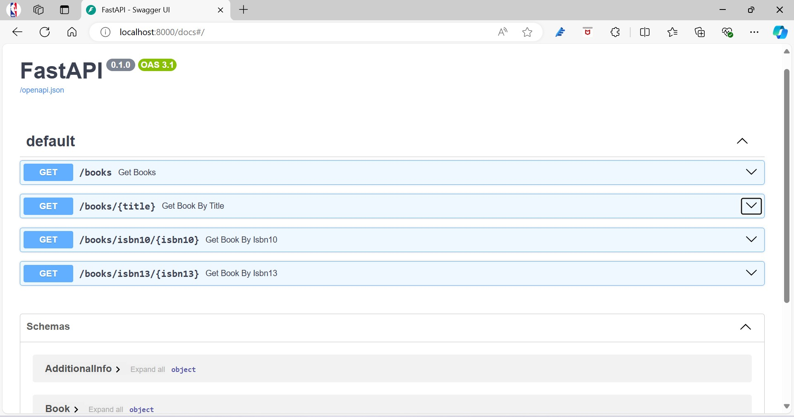
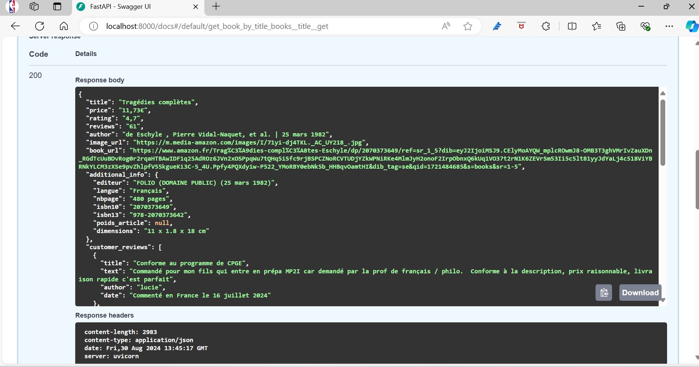

<h2 align="center" style="font-size: 20px;">Une Solution de Web Scraping pour des Livres Amazon</h2>

Projet Data Engineering - Louis Duvieux

  

  
  
  
  

## Introduction

Ce projet a pour objectif d'améliorer le catalogue de vente en ligne d'une librairie en proposant, sur sa page d’accueil et dans ses campagnes de communication (newsletter, réseaux sociaux), une liste des livres les mieux notés et les plus appréciés par les clients. Les données récupérées et traitées sont mises à disposition des équipes de data analysts pour réaliser, par exemple, des analyses de sentiment sur les avis des clients. De plus, ces données sont accessibles aux différentes équipes métiers pour améliorer leurs prises de décision stratégiques et opérationnelles. Les données sont ensuite exposées via une API construite avec FastAPI pour une intégration facile avec d'autres systèmes.

## Architecture du Projet

### Pipeline de Données

Le pipeline de données est conçu pour scraper les informations sur les livres depuis Amazon, les transformer, les stocker dans une base de données MongoDB, et enfin les exposer via une API construite avec FastAPI, laquelle est encapsulée dans un conteneur Docker pour faciliter le déploiement.

### Planification et Orchestration

**Airflow** est utilisé pour orchestrer l'exécution de l'ETL une fois par mois à 7h du matin, le premier jour du mois.
**Le DAG Airflow** est composé de trois tâches exécutées séquentiellement : extraction, transformation et chargement des données.

## Description des Données
Les données sont extraites directement du site d'Amazon puis exportées au format JSON et stockées dans MongoDB. Chaque observation contient les caractéristiques suivantes :

- `title` : Titre du livre.
- `price` : Prix du livre.
- `rating` : Note moyenne du livre.
- `reviews` : Nombre d'avis.
- `author` : Auteur du livre.
- `image_url` : URL de l'image de couverture.
- `book_url` : URL de la page du livre sur Amazon.
- `additional_info` : Informations supplémentaires comme l'éditeur, la langue, le nombre de pages, ISBN10, ISBN13, etc.
- `customer_reviews` : Liste d'avis clients comprenant le titre de l'avis, le texte, l'auteur et la date.

## Structure du Projet

### Répertoires et Fichiers

<pre>
BookScraper/
├── app/
│   ├── main.py
│   └── requirements.txt
├── config/
│   └── setup_airflow.sh
├── dags/
│   └── monthly_script_execution.py
├── data/
│   ├── books_modifier.json
│   └── books.json
├── etl/
│   ├── books_extract.py
│   ├── books_load.py
│   └── books_transformation.py
└── Dockerfile

</pre>

### Scripts Principaux

1. **Extraction des données et transformation des données** :

  - `books_extract.py` : Script pour scraper les données de la page Amazon.
  - `books_transformation.py` : Script pour nettoyer et transformer les données.

2. **Chargement des Données dans MongoDB** :

  - `books_load.py` : Script pour charger les données transformées dans une base MongoDB.

3. **Orchestration avec Airflow** :

  - `monthly_script_execution.py` : Ce script planifie et exécute les tâches ETL une fois par mois à l'aide de Airflow.

4. **API FastAPI** :

  - `main.py` : Ce script contient une API FastAPI qui permet de récupérer les livres stockés dans MongoDB. Les endpoints permettent de récupérer tous les livres, ou de filtrer par titre, ISBN10, ou ISBN13.
  - `Dockerfile` : Ce fichier Docker encapsule l'application FastAPI, permettant de la déployer facilement dans des environnements variés.

## Axes d'Amélioration

1. **Amélioration de la Qualité des Données** :

  - **Détection des Anomalies** : Mettre en place des mécanismes pour détecter et gérer les anomalies dans les données, comme des notes aberrantes ou des avis en double, pour assurer une qualité de données optimale.
  - **Enrichissement des Données** : Intégrer d'autres sources de données, telles que des bases de données de critiques littéraires ou des réseaux sociaux, pour enrichir les informations sur les livres et obtenir une vue plus complète des tendances et des avis des clients.

2. **Optimisation des Performances** :

  - **Scraping Optimisé** : Améliorer l'efficacité du processus de scraping en utilisant des techniques comme le scraping asynchrone pour réduire le temps d'exécution et gérer un plus grand volume de pages.
  - **Indexation MongoDB** : Mettre en place des index sur les champs les plus fréquemment utilisés dans les requêtes (comme le titre du livre, l'auteur, ISBN10, ISBN13) pour accélérer les temps de réponse de l'API.

3. **Extension de l'API** :

  - **Filtres Avancés** : Ajouter des filtres plus avancés dans l'API, tels que la recherche par genre, date de publication, ou prix, pour permettre aux utilisateurs d'obtenir des informations plus précises.
  - **Analyses Prédictives** : Intégrer des algorithmes de machine learning pour fournir des recommandations personnalisées ou prédire les tendances des ventes basées sur les avis et les notes des utilisateurs.*

## Présentation des Résultats
Le résultat final est une API, encapsulée dans un conteneur Docker, qui expose les données des livres stockés dans MongoDB. Cette API peut être utilisée pour intégrer les données dans d'autres systèmes, pour des analyses ou des recommandations sur la page d'accueil de la librairie, ainsi que pour des campagnes marketing ciblées. Un Swagger est également disponible pour explorer et tester facilement les différents endpoints de l'API.

  

  

